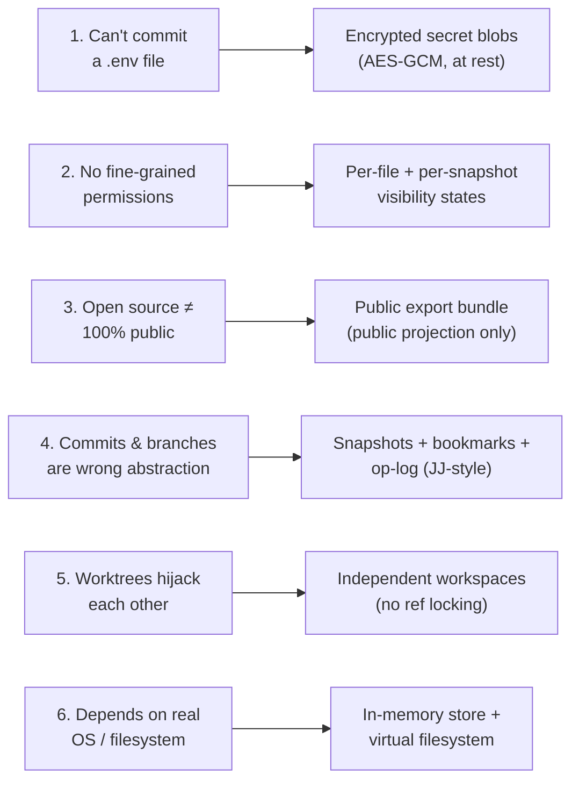
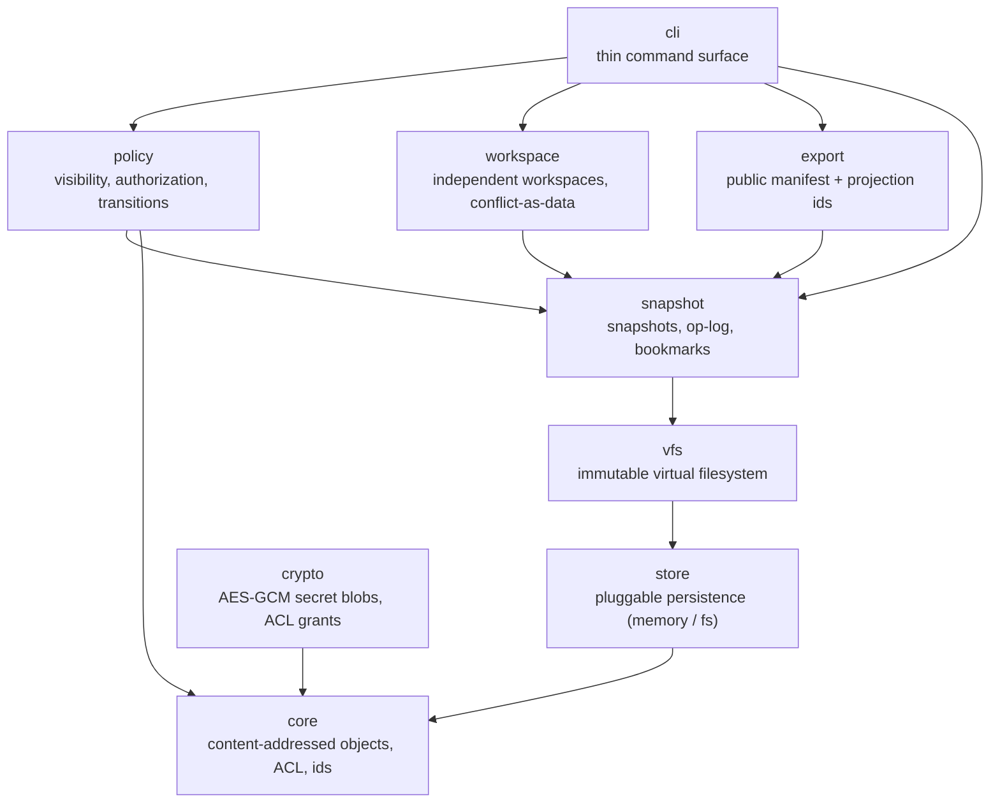
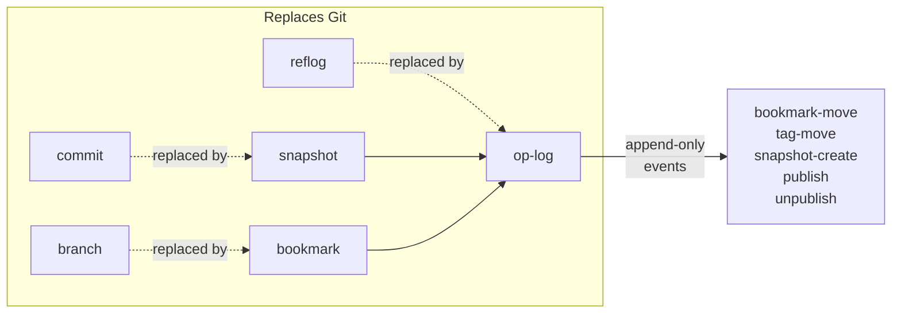
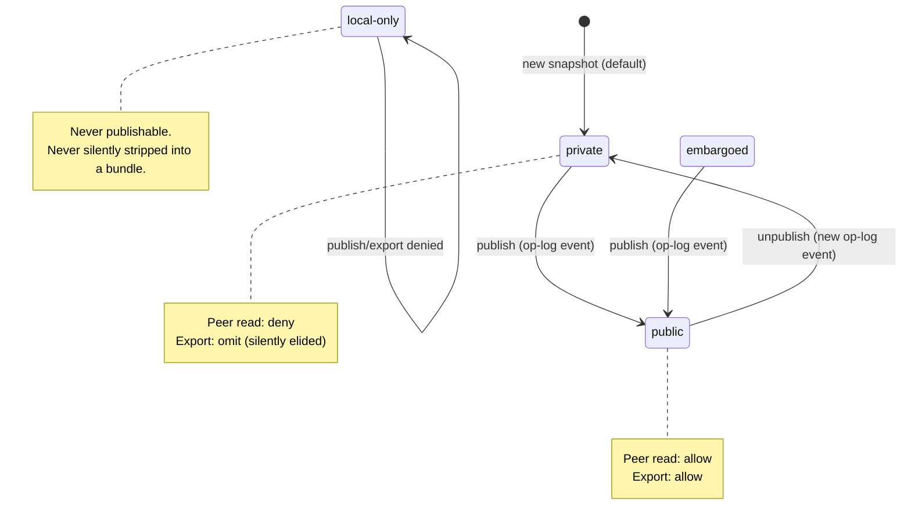
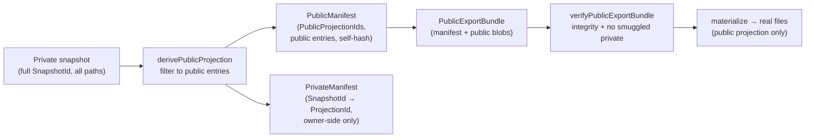

# Git that Theo wants

Idea from Theo (https://x.com/theo/status/2069621429189161350 / https://www.youtube.com/watch?v=wEAb0x3wTRc). Note that Theo has no endorsement on this project (yet).

`gtw` is a **prototype** source-control model that addresses six pain points Theo raised about Git. It is a local, deterministic, in-process simulation of the data model — not a production VCS and not a server-backed control plane (see [Scope & limitations](#scope--limitations)).

- **Runtime:** TypeScript + [Bun](https://bun.sh), zero dependencies.
- **Status:** All eleven chunks (C0–C10) are complete and tested.
- **Try it:** `bun run examples/demo.ts` exercises all six pain points in one run.

---

## Why reinvent source control?

Theo thinks Git is not the right abstraction for many scenarios. It's better than all previous source code control systems, so it became the standard. But since Git was invented, a lot has changed, and both Git and GitHub are "rotting from the core."

### Core pain points

1. **Why can't you commit a `.env` file?**
   The superficial answer is: "Because anyone with access to the repository can see sensitive information." But that's just "the way Git works" — and that's not a good reason. It's a design flaw, not a feature. All those companies that manage secrets (Doppler, Vault, etc.) ultimately just produce a random file on your machine, which is exactly proof that Git has let us down.

2. **Lack of fine-grained permissions**:
   Why can't there be private files? Private branches? PRs that stay private until merge? Delayed public release timing? Why are permissions repository-level instead of file-level? Git has none of these concepts at all because it was built for Linux, where these things weren't necessary for Linux development. But now even Linux needs them — when security vulnerabilities are patched, everyone's agents are reading the patch and trying to find zero-days before the official announcement. It would be much better if the Linux team could merge security fixes privately, publish the release, and distribute it to distro maintainers before the code becomes public.

3. **Open source does not mean 100% of the code is 100% public**:
   Many projects would be more willing to open source their code if they could hide unfinished PRs. Many security fixes are delayed because the moment they appear in the tracker, they get exploited. Many projects are forced to split into multiple repositories because they want to open source part of the code, but not all of it.

4. **Commits and branches are not suitable for modern development**:
   Theo likes what JJ (Jujutsu) does — using snapshots and tags instead of branches and commits. JJ solves many source control ergonomics problems and made Theo realize that we waste too much time on things that don't matter.

5. **Worktrees are absolutely terrible**:
   Theo once had an agent's worktree check out `main`, which caused Theo to be unable to check out `main` in the main directory because it had been "hijacked" by some random worktree.

6. **Source control should not depend on the real operating system and file system**:
   In a world with Bash (a JavaScript/TypeScript layer that can emulate bash, allowing agents to run without a real Linux kernel or file system), using the CLI to operate Git on real files in a real environment is just stupid. Randomly cloning files in memory is much easier than moving a large number of files around on the system.

### The APFS rant

Theo shared a disk performance benchmark: cloning a project + installing with PNPM from cache, using only file creation operations:
-  Ubuntu + mid-range AMD CPU + ordinary SSD: **6.8 seconds**
-  M4 Mac + high-end Apple SSD: **31 seconds**
-  M1 Ultra: **more than 140 seconds**

For the same task, a MacBook running Ubuntu takes only **3–12 seconds**. APFS is complete garbage when handling lots of small files. This makes it extremely painful to spin up lots of small runtimes for agents. Theo believes this is further proof that we should move away from the file system.

---

## How gtw addresses them

Each pain point maps onto a concrete feature of the data model. The demo (`examples/demo.ts`) exercises all six in one local, deterministic, in-process run.



| # | Pain point | gtw feature | Demo step |
|---:|---|---|---|
| 1 | Commit a `.env` without leaking plaintext | First-class encrypted `SecretBlob` (AES-GCM, self-describing framed ciphertext); `.env` is `private`-visibility so it's omitted from public export | Stores `.env` as a secret-blob, asserts raw bytes contain no plaintext, only the authorized key decrypts |
| 2 | Fine-grained permissions | Four visibility states (`public`/`private`/`embargoed`/`local-only`) at both file and snapshot level, with a deterministic state-operation matrix | Keeps `notes/private-roadmap.md` readable by the owner but omitted from the public bundle |
| 3 | Partial open source | Public export bundle carries only public entries + `PublicProjectionId`s (never full `SnapshotId`s); a `PrivateManifest` correlates them owner-side | Builds a public bundle containing only `src/public.ts`; `.env` and the private path are absent; starts the PR-equivalent snapshot private, then runs `publish` and `unpublish` |
| 4 | Commits & branches | Content-addressed snapshots chained by `parentId`; named bookmarks/tags replace branches; an append-only op-log replaces the reflog | Creates a snapshot, tags it `demo-v1`, records the tag move in the op-log |
| 5 | Worktree hijacking | Workspaces are independent: the ref pointer is non-owning, so multiple workspaces can check out the same ref without locking it | Two workspaces check out `main`, snapshot independent changes, `main` stays unmoved |
| 6 | Filesystem dependence | The core programs against a `Store` interface; `MemoryStore` is the primary backend; real-FS is an optional, late-bound adapter | The whole flow runs on `MemoryStore` + `VirtualTree` + an in-memory bundle — no clone |

The full pain-point-to-chunk mapping lives at [`docs/plan/pain-point-mapping.md`](docs/plan/pain-point-mapping.md).

---

## Architecture overview

`gtw` is organized into nine dependency-ordered layers. Dependencies point strictly downward — the core never imports upward — so each layer is independently testable.



| Layer | Owns | Key types |
|---|---|---|
| `core` | Content-addressed primitives, framing, ids | `Hash`, `Blob`, `ContentObject`, `SignedAclNode`, `SecretBlob`, `SnapshotEnvelope` |
| `store` | Pluggable persistence seam (crypto-agnostic) | `Store`, `MemoryStore`, `FsStore`, `ManifestRefs` |
| `vfs` | Immutable virtual filesystem over snapshot blobs | `VirtualTree`, `read`/`write`/`move`/`remove`, `materialize` |
| `snapshot` | Snapshot identity, op-log, bookmarks | `Snapshot`, `SnapshotId`, `OpLog`, `Bookmarks` |
| `workspace` | Working-copy-as-snapshot, independent workspaces | `WorkingCopy`, `Workspace`, `WorkspaceManager`, `Conflict` |
| `policy` | Visibility states, authorization, transitions | `VisibilityState`, `matrixDecision`, `VisibilityLog`, `PrivateManifest` |
| `export` | Public projection + export bundle | `PublicManifest`, `PublicProjectionId`, `PublicExportBundle` |
| `crypto` | Per-object encryption + signed grants | `SecretKey`, `encryptSecret`/`decryptSecret`, `createReadGrant` |
| `cli` | Thin command dispatcher + session | `CliSession`, 14 commands |

### Snapshot model

`gtw` replaces Git's commits + branches + reflog with **snapshots + bookmarks + an op-log**, inspired by [Jujutsu](https://github.com/martinvonz/jj).

- A **snapshot** is content-addressed: its `SnapshotId` is the SHA-256 of its core state — `parentId`, the canonical `(path, blobId)` tree entries, `timestamp`, `message`, and an `immutable` flag. Snapshots chain by `parentId`.
- **Bookmarks** and **tags** are named pointers to snapshots. Moving a bookmark or tag appends a new op-log event rather than silently rewriting history.
- The **op-log** is an append-only event log (replacing Git's reflog). Events: `bookmark-move`, `tag-move`, `snapshot-create`, `publish`, `unpublish`.
- There is no index/staging area and no "current branch." The working copy is auto-snapshotted at each command boundary (JJ-style).



A keystone design decision: the `SnapshotId` **excludes manifest refs** (`publicManifestRef`/`privateManifestRef`), so a manifest can be attached to an already-final snapshot without changing its id. See [`docs/ARCHITECTURE.md`](docs/ARCHITECTURE.md#10-snapshotid-excludes-manifest-refs-the-keystone) for the hash-cycle rationale.

### Visibility & publishing

Every file and every snapshot carries a visibility state. Authorization is a **pure function** of `(state, operation, role)` — there is no time-based side channel.

| State | Owner read | Peer read | Export | Publish |
|---|---|---|---|---|
| `public` | allow | allow | allow | — |
| `private` | allow | deny | omit (silently elided) | allow (→ `public`) |
| `embargoed` | allow | deny | omit | allow (→ `public`, explicit only) |
| `local-only` | allow | deny | deny (never publishable) | deny |

`publish` and `unpublish` are **append-only op-log events**. `unpublish` re-privatizes a snapshot for *future* readers — it cannot recall content a public peer already fetched (the same best-effort limit as revocation). The op-log stays append-only: a publish followed by an unpublish leaves two events.



### Public export

A public export bundle carries **only** public data. It never contains full `SnapshotId`s (which embed timestamps, messages, private paths, and private blob ids), private paths, timestamps, messages, op-log entries, or secret ids.

- A **`PublicProjectionId`** is derived only from a snapshot's public entries and its nearest public-visible ancestor projection ids. Private-only and public-noop snapshots are elided from the parent chain.
- Consequence: two snapshots with identical public entries but different private-only history produce **identical** projection ids, manifests, and bundle hashes. A public peer cannot distinguish private histories.
- The **`PublicManifest`** carries projection ids, public entries `{path, blobId}`, and a deterministic self-hash. The **`PrivateManifest`** (owner-side only) maps `SnapshotId → PublicProjectionId` for correlation.
- `materialize` (the only real-FS writer in the core) writes only the C6-filtered public projection to disk — never the raw snapshot/`VirtualTree`.



---

## Getting started

Prerequisites: [Bun](https://bun.sh) ≥ 1.3.

**Run the demo** — exercises all six pain points locally:

```bash
bun run examples/demo.ts
```

**Use the CLI** — a thin command surface over the same core:

```bash
# Initialize a fresh session (durable at .gtw/ by default)
bun run src/cli/index.ts init

# Write a file and auto-snapshot the working copy
bun run src/cli/index.ts snapshot create src/public.ts "export const visible = 'hi';" --message "add public file"

# Tag the snapshot, then publish it
bun run src/cli/index.ts tag create v1 <snapshot-id>
bun run src/cli/index.ts publish <snapshot-id>

# Export the public projection to real files
bun run src/cli/index.ts export --to ./out

# Check visibility, then re-privatize
bun run src/cli/index.ts publish-check <snapshot-id>
bun run src/cli/index.ts unpublish <snapshot-id>
```

**Run the tests:**

```bash
bun test
```

## CLI reference

The global `--root <dir>` flag (default `.gtw`) selects the durable state root for all commands.

| Command | Purpose |
|---|---|
| `init [--fs <dir>]` | Initialize a fresh session (durable at `.gtw/` by default; `--fs` sets the export root) |
| `status` | Show workspace, head, bookmarks, tags, snapshot count |
| `snapshot create <path> <content> [--message <m>]` | Write a file and auto-snapshot the working copy |
| `snapshot show <id>` | Show a snapshot's core state and visibility |
| `snapshot list` | List all stored snapshot ids and visibility |
| `bookmark list` | List bookmarks and their targets |
| `bookmark set <name> <id>` | Create or move a bookmark to a snapshot |
| `tag create <name> <id>` | Create a tag pointing at a snapshot |
| `tag list` | List tags and their targets |
| `restore <id>` | Check out a snapshot into the current workspace |
| `export [--to <dir>] [--out <file>] [--snapshot <id>]` | Export the public bundle (or materialize to `<dir>`) |
| `publish <id>` | Transition a snapshot to public (op-log event) |
| `publish-check <id>` | Report a snapshot's current visibility |
| `unpublish <id>` | Re-privatize a public snapshot (new op-log event) |

There is no `fetch` command — public-peer visibility is in-process via the public manifest/bundle. `export` is always produced from the public projection, never the raw snapshot/working tree.

---

## Scope & limitations

`gtw` is a **local deterministic prototype**, not a production VCS. The following are explicitly out of scope for this prototype:

- **No server / control plane.** No HTTP/RPC API, no remote authn/authz, no server-side enforcement as source of truth. Permission checks run in-process. A future server chunk is the upgrade path, not this prototype.
- **No network transfer / fetch / remote peers.** Public-peer visibility is demonstrated in-process via the public manifest/bundle, not over a network.
- **Non-production cryptography.** Key material is a local stub (HMAC signing, symmetric local keys). No KMS/HSM, no key escrow, no asymmetric key wrapping. Crypto has not been audited.
- **Revocation is best-effort.** History is not re-encrypted on revoke; revocation prevents *future* reads by revoked actors but cannot recall already-fetched history. `unpublish` has the same limit.
- **No real embargo / timed-release guarantees.** `embargoed` requires an explicit `publish` event — there is no time-based auto-release and no distro-maintainer distribution pipeline.
- **No Git interop bridge.** No push/pull to real Git remotes. Real-FS export is one-way and best-effort.
- **Single-actor simulation.** "Unauthorized peer" is modeled as a second in-process actor with a different key, not a network peer.
- **No store deletion / GC.** Content-addressed objects and snapshot envelopes are append-only; the `ManifestRefs` attachment is the sole mutable upsert surface.

The full out-of-scope list and rationale is in [`docs/plan/plan.md`](docs/plan/plan.md) §5.

---

## Project structure

```
src/
  core/       content-addressed objects, ACL, ids, secret-blob, snapshot contract
  store/      pluggable Store interface + MemoryStore (primary) + FsStore (optional)
  vfs/        immutable VirtualTree, ops, one-way public materialize
  snapshot/   Snapshot, OpLog, Bookmarks
  workspace/  WorkingCopy, independent Workspaces, conflict-as-data
  policy/     visibility states, authorization, transitions, private manifest
  export/     public manifest, projection ids, export bundle
  crypto/     AES-GCM secret blobs, keys, signed ACL grants
  cli/        thin dispatcher, commands, session, durable backing, export artifact
examples/     demo.ts — end-to-end local simulation of all six pain points
tests/        per-layer bun tests mirroring src/
docs/
  plan/       plan.md, checklist.md, pain-point-mapping.md
  ARCHITECTURE.md   architecture & contributing guide for extenders
```

For a deep dive into the layer seams, the C0–C10 chunk structure, key design decisions, and extension points, see [`docs/ARCHITECTURE.md`](docs/ARCHITECTURE.md).
