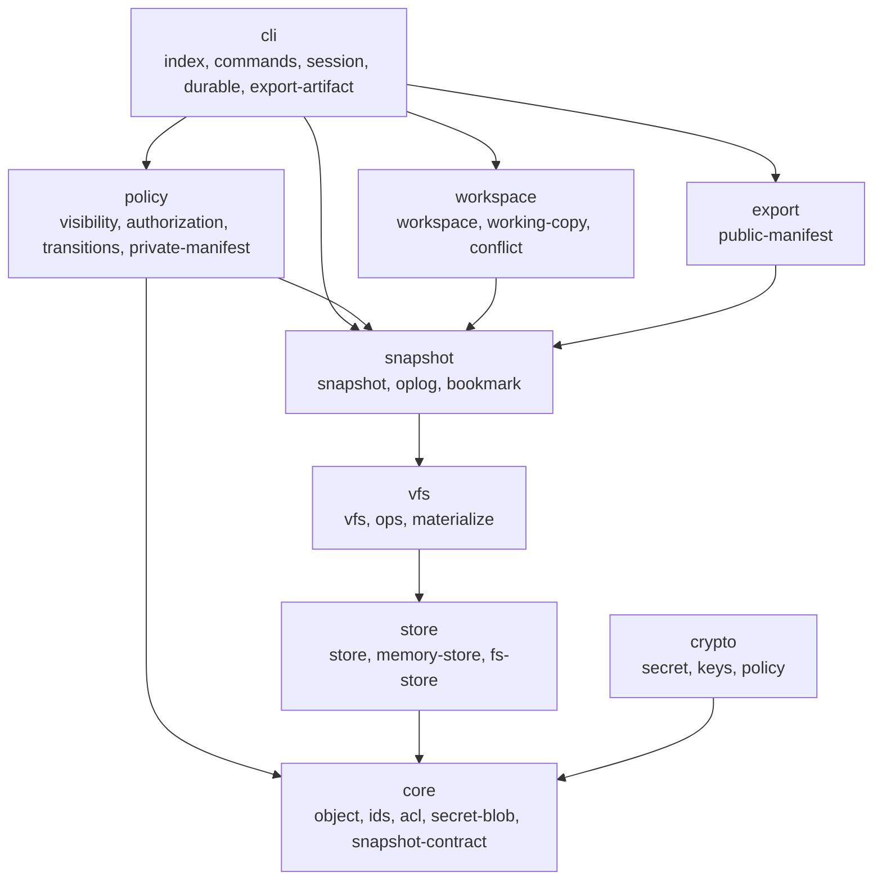
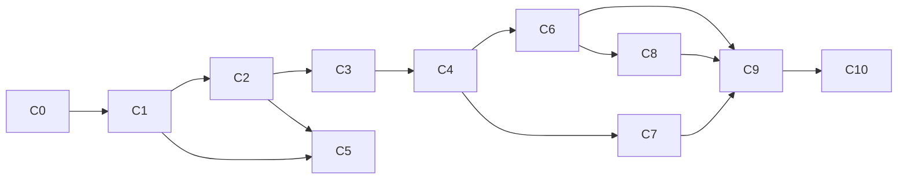
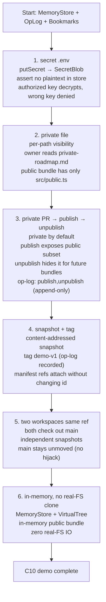

# Architecture & contributing

This document is for engineers who want to understand `gtw` internals or extend the prototype. For the project rationale, pain-point mapping, getting-started, and CLI reference, see the [README](../README.md). This doc does not repeat that material.

---

## Layered architecture

`gtw` is organized into nine dependency-ordered layers. The dependency direction is **strictly downward** — core never imports store/vfs/snapshot; vfs imports core+store; snapshot imports core+vfs; policy imports core+snapshot; cli imports everything. This makes each layer independently testable.



### Layer ownership

| Layer | Directory | Owns | Does NOT |
|---|---|---|---|
| `core` | `src/core/` | Content-addressed primitives, framing, branded ids, ACL records, secret-blob shape, snapshot storage contract | IO, persistence, crypto operations |
| `store` | `src/store/` | `Store` interface, `MemoryStore`, `FsStore`, `ManifestRefs` attachment | Content addressing (ids are pre-computed by core), crypto |
| `vfs` | `src/vfs/` | `VirtualTree` (immutable path→blob-id map), `read`/`write`/`move`/`remove`, one-way `materialize` | Snapshot construction (that's `snapshot`), private data (materialize only sees the public bundle) |
| `snapshot` | `src/snapshot/` | `Snapshot` record + `SnapshotId` derivation, `OpLog`, `Bookmarks` | Working-copy state (that's `workspace`), visibility (that's `policy`) |
| `workspace` | `src/workspace/` | `WorkingCopy` (JJ-style), `Workspace`/`WorkspaceManager`, `Conflict` | Persistence (delegates to store), ref ownership (ref pointers are non-owning) |
| `policy` | `src/policy/` | Visibility states, `matrixDecision`, `VisibilityLog`, `publish`/`unpublish`, `PrivateManifest` | Crypto (delegates to `crypto`), export bundle shape (that's `export`) |
| `export` | `src/export/` | `PublicManifest`, `PublicProjectionId` derivation, `PublicExportBundle`, manifest-ref attachment | Real-FS writing (that's `vfs/materialize`) |
| `crypto` | `src/crypto/` | `SecretKey`, `encryptSecret`/`decryptSecret`, `createReadGrant`/`verifyReadGrant`, key rotation | Storage (delegates to `store` via the core envelope) |
| `cli` | `src/cli/` | Dispatcher, command handlers, `CliSession`, durable backing, export artifact serialization | Business logic (delegates everything to the layers below) |

### Structural invariants

- **Append-only immutability is enforced structurally, not by convention.** The `Store` interface has no delete methods. Conflicting re-puts throw typed errors (`ObjectConflict`/`AclConflict`/`SnapshotConflict`). The `ManifestRefs` attachment is the sole mutable upsert surface.
- **Byte buffers are cloned at the store boundary** on both put and get (`new Uint8Array(bytes)`, not `.slice()`), so callers can never mutate stored state through aliased references — including `Buffer`-backed inputs.
- **Privacy is enforced at the export boundary, not the storage boundary.** Secret blobs are encrypted at rest, but metadata privacy (no private paths/timestamps/messages/`SnapshotId`s in public exports) is enforced by `derivePublicProjection` + `verifyPublicExportBundle` in the `export` layer. `materialize` only ever sees the filtered bundle.
- **Authorization is a pure function.** `matrixDecision(state, op, role)` has no I/O and no time component. `embargoed` does not auto-release.

---

## Chunk structure (C0–C10)

The prototype was built in eleven dependency-ordered, verifiable, committable chunks (C0–C10). Each chunk is a strict seam over the ones below. The dependency graph:



| Chunk | Name | Owns | Status |
|---|---|---|---|
| C0 | Repo & tooling bootstrap | `package.json`, `tsconfig.json`, `.gitignore`, `src/index.ts`, `src/cli/index.ts` stub, `tests/smoke.test.ts` | ✅ |
| C1 | Core object model | `src/core/object.ts`, `ids.ts`, `acl.ts`, `snapshot-contract.ts` — content-addressed blobs, `ContentObject` envelope, signed ACL graph, `SnapshotEnvelope` storage contract | ✅ |
| C2 | Pluggable store | `src/store/store.ts`, `memory-store.ts` — `Store` interface + `MemoryStore` + `ManifestRefs` attachment | ✅ |
| C3 | Virtual filesystem | `src/vfs/vfs.ts`, `ops.ts` — immutable `VirtualTree`, read/write/move/remove | ✅ |
| C4 | Snapshot working-copy model | `src/snapshot/snapshot.ts`, `oplog.ts`, `bookmark.ts`, `src/workspace/working-copy.ts` — `Snapshot` + `SnapshotId`, `OpLog`, `Bookmarks`, JJ-style working copy | ✅ |
| C5 | First-class secret file | `src/crypto/secret.ts`, `keys.ts`, `policy.ts`, `src/core/secret-blob.ts` — AES-GCM `SecretBlob`, signed ACL read grants, key rotation | ✅ |
| C6 | Visibility & privacy | `src/policy/visibility.ts`, `authorization.ts`, `transitions.ts`, `private-manifest.ts`, `src/export/public-manifest.ts` — 4 states, matrix, publish/unpublish, public/private manifest split, `PublicProjectionId` | ✅ |
| C7 | Workspace independence | `src/workspace/workspace.ts`, `conflict.ts` — independent workspaces, no ref locking, conflict-as-data | ✅ |
| C8 | Real-FS materialization adapter | `src/vfs/materialize.ts`, `src/store/fs-store.ts` — one-way public-projection materialize, optional `FsStore` | ✅ |
| C9 | Thin CLI | `src/cli/index.ts`, `commands.ts`, `session.ts`, `durable.ts`, `export-artifact.ts` — 14 commands, in-memory + durable session | ✅ |
| C10 | End-to-end demo & mapping | `examples/demo.ts`, `docs/plan/pain-point-mapping.md` — all six pain points in one run | ✅ |

The full chunk specs, acceptance criteria, and dependency edges live in [`docs/plan/plan.md`](plan/plan.md) with a companion checklist in [`docs/plan/checklist.md`](plan/checklist.md).

---

## Key design decisions

These are the foundational choices that shape the data model. They are recorded in detail in `docs/plan/plan.md` §2; this section summarizes the ones most relevant to extending the codebase.

### 1. ACL-overlay, not capability-addressing

Content addressing is preserved for blobs (dedup); access control lives in a **separate signed metadata graph** layered over content objects. ACL bytes never enter the content hash. This avoids breaking dedup and is the least surprising fork. (`src/core/acl.ts`)

### 2. Metadata privacy is separate from ciphertext

Public and private manifests are separated. Private object metadata (paths, sizes, change timing, op-log entries, manifest refs, blob/secret ids, **and full `SnapshotId` values**) must not leak into public exports. Public exports use `PublicProjectionId`s derived only from public entries/public metadata, not full `SnapshotId`s. (`src/export/public-manifest.ts`, `src/policy/private-manifest.ts`)

### 3. Revocation is best-effort

History is not re-encrypted on revoke; revocation prevents *future* reads by revoked actors but cannot recall already-fetched history. `unpublish` has the same limit. Recorded as a known limitation, not a silent gap.

### 4. Access policy is bound to signed graph state

Access policy is bound to signed/authenticated graph state, not to a user-editable config file (git-crypt's `.gitattributes` tampering failure mode). (`src/crypto/policy.ts`, `src/core/acl.ts`)

### 5. Auto-snapshot with immutable marker

Auto-snapshot on command boundary (like jj), with an explicit `immutable` flag so auto-snapshots can be squashed without rewriting published history. (`src/workspace/working-copy.ts`, `src/snapshot/snapshot.ts`)

### 6. TypeScript + Bun runtime

A technology choice, not a data-model decision — covered in the README's Getting started. Recorded here only to preserve the numbering from `docs/plan/plan.md` §2.

### 7. Publish is irreversible; rollback is a new op-log event

Once a snapshot is `publish`ed, the op-log records the transition. `unpublish` is a **new** visibility-changing op-log event that flips the snapshot back to `private` for *future* readers; it cannot recall already-exported content. The op-log stays append-only. (`src/policy/transitions.ts`)

### 8. Public exports use public-projection ids

A full `SnapshotId` embeds timestamps, messages, private paths, and private blob ids — it is therefore private. Public exports carry `PublicProjectionId`s derived only from public entries and nearest-public-visible-ancestor projection ids. Two snapshots with identical public entries but different private-only history produce identical projection ids, manifests, and bundle hashes. (`src/export/public-manifest.ts`)

### 9. SecretBlob ciphertext is self-describing and framed

Stored ciphertext carries its own nonce/IV, algorithm, version, and GCM auth tag: `version(1) || algId(1) || iv(12) || ciphertext(N) || tag(16)`. Decryption is implementable from the stored bytes alone with no out-of-band IV. A wrong key fails GCM auth-tag verification → `Denied`. (`src/core/secret-blob.ts`, `src/crypto/secret.ts`)

### 10. SnapshotId excludes manifest refs (the keystone)

The `SnapshotId` is the content hash of the snapshot's **core state** only — `parentId`, canonical tree entries `(path, blobId)`, `timestamp`, `message`, `immutable`. The `publicManifestRef`/`privateManifestRef` fields are **not** inputs to the hash.

This breaks what would otherwise be a fixed-point cycle: C6's private manifest maps `SnapshotId → PublicProjectionId` (so it contains `SnapshotId`s) and upserts its own content hash into that snapshot's `privateManifestRef`. If `SnapshotId` hashed `privateManifestRef`, computing the manifest would require an id that depends on the manifest. Excluding refs makes it acyclic — a manifest can be computed from a snapshot whose id is already final, then attached via `Store.putManifestRefs` without changing the id or replacing the immutable envelope. `Snapshot.withManifestRefs` returns a same-id snapshot.

Tree identity is the canonical sorted `(path, blobId)` set, so a path-only rename/move changes the `SnapshotId` even when every blob id is unchanged. (`src/snapshot/snapshot.ts`)

---

## Data model deep dive

### Snapshot identity and persistence

A `Snapshot` = core state + opaque manifest-ref attachments:

```
Snapshot {
  id: SnapshotId,            // hash of core state (excludes manifest refs)
  parentId: SnapshotId | null,
  tree: ReadonlyMap<path, blobId>,   // canonical (sorted) entries
  timestamp: number,
  message: string,
  immutable: boolean,
  publicManifestRef: Hash | null,    // attached later via Store.putManifestRefs
  privateManifestRef: Hash | null,   // attached later via Store.putManifestRefs
}
```

Persistence is split:
- `saveSnapshot` puts the immutable `SnapshotEnvelope` (`{id, parentId, serializedBytes}` — core bytes only, append-only/idempotent) **and** upserts the mutable `ManifestRefs` attachment (`{publicManifestRef, privateManifestRef}` — the sole upsert surface).
- `loadSnapshot` reads both and reconstructs the full `Snapshot`.
- Changing only manifest refs does **not** change the `SnapshotId`. Changing `parentId`, any tree entry (path or blob id), `timestamp`, `message`, or `immutable` **does**.

### Op-log

The `OpLog` is an append-only event log replacing Git's reflog. Events are frozen immutable records with a monotonic 1-indexed `seq`. Kinds: `bookmark-move`, `tag-move`, `snapshot-create`, `publish`, `unpublish`. A move never rewrites a previous entry — it appends a new event, making pointer-move history recoverable and supporting jj-style undo by replay. (`src/snapshot/oplog.ts`)

### Bookmarks and tags

`Bookmarks` holds two mutable `Map`s (bookmarks, tags) but every mutation appends an op-log event. `createBookmark`/`createTag` throw `BookmarkExists` if the name is taken; `moveBookmark`/`moveTag` throw `BookmarkNotFound` if absent and record a `{name, from, to}` event. Bookmarks and tags share the same mechanism; the only distinction is intent (bookmarks = movable pointers like jj; tags = labels). There is no "current branch" concept. (`src/snapshot/bookmark.ts`)

### Visibility log and transitions

`VisibilityLog` replays op-log `publish`/`unpublish` events over durable non-public initial states. Its mutators are module-private (an unexported `INTERNAL_TOKEN` symbol) — external callers cannot bypass the op-log. `public` is reachable **only** via `publish()`; `private` is reachable from `public` **only** via `unpublish()`. `setVisibility` is restricted to non-public initial states and rejected once a snapshot has any transition history. (`src/policy/transitions.ts`)

### Public projection

`computePublicProjectionId = SHA-256(bundleVersion || canonical(publicEntries) || canonical(parentProjectionIds))`. Parent projection ids are the nearest public-visible ancestor projection ids — private-only and public-noop snapshots are elided. A snapshot whose public entries and public-visible parents are unchanged from its nearest public-visible ancestor **reuses** that ancestor's projection id. This is the key privacy property: public peers cannot distinguish private histories. (`src/export/public-manifest.ts`)

---

## Extension points

### Add a new store backend

Implement the `Store` interface (`src/store/store.ts`). The interface is crypto-agnostic and content-addressing-agnostic — you persist/retrieve `ContentObject`, `SignedAclNode`, `SnapshotEnvelope` by their pre-computed ids, and upsert `ManifestRefs`. Requirements:

- `putObject`/`putAcl`/`putSnapshot` are idempotent for identical data and throw `ObjectConflict`/`AclConflict`/`SnapshotConflict` on same-id/different-data.
- `listSnapshots` returns ids in insertion order (persist an order file if your backend doesn't preserve it — see `FsStore`'s `snapshot-order.txt`).
- No delete methods (append-only).
- Clone byte-bearing values at the boundary on both put and get.

Register it where needed (e.g. `src/cli/session.ts` or `src/cli/durable.ts` for CLI use). `MemoryStore` and `FsStore` are the references.

### Add a new visibility state

1. Add the state to `VisibilityState` and `VISIBILITY_STATES` in `src/policy/visibility.ts`.
2. Extend the `matrixDecision` pure function for the new state × all operations × both roles.
3. Update `PUBLISHABLE_STATES` / `publishTarget` / `unpublishTarget` if the state is publishable.
4. Update `transitions.ts` if the state participates in `publish`/`unpublish`.
5. Update `publicEntriesOf` in `src/export/public-manifest.ts` if the state affects export filtering.
6. Update tests in `tests/policy/` and `tests/export/`.

### Add a new CLI command

1. Write a `cmd<Name>` handler in `src/cli/commands.ts` — parse argv, delegate to the core layers via `CliSession`, return a string.
2. Register it in the `COMMANDS` table in `src/cli/index.ts` (in documented order).
3. Add it to the `HELP` text in `src/cli/index.ts`.
4. Add integration coverage in `tests/cli/cli.test.ts`.

The dispatcher resolves the longest command prefix, so two-token commands (`snapshot create`) are tried before one-token ones. Handlers get the remaining argv after the command name.

### Add a new op-log event kind

1. Add the kind to the `OpLog` event union in `src/snapshot/oplog.ts` and an `append<Kind>` helper.
2. If it affects visibility, extend `VisibilityLog` replay in `src/policy/transitions.ts`.
3. If it should persist across CLI invocations, handle it in `src/cli/durable.ts` load/save.

### Add a new object kind

1. Add the kind to the `ContentObject` `kind` union in `src/core/object.ts` and update `contentFraming`/`contentObjectId`/serialization.
2. The store seam needs no change (it's kind-agnostic), but add round-trip tests in `tests/core/`.
3. If the kind has crypto needs, add a module under `src/crypto/` mirroring `secret.ts`.

### Add a new materialization target

`materialize` in `src/vfs/materialize.ts` takes a verified `PublicExportBundle` and writes public blobs to a target directory. To add a different target (e.g. a tarball, a remote object store), write a new function that consumes the same `PublicExportBundle` — but **never** bypass `verifyPublicExportBundle` and **never** feed it the raw `Snapshot`/`VirtualTree`. The export-privacy invariant is that materialization only ever sees the C6-filtered public projection.

---

## Demo walkthrough

`examples/demo.ts` is a single in-process deterministic simulation. It does **not** shell out to the CLI — it drives the same core APIs the CLI delegates to. Run it with `bun run examples/demo.ts`.



The demo's six steps map 1:1 onto the six README pain points. The full pain-point → feature → chunk mapping is in [`docs/plan/pain-point-mapping.md`](plan/pain-point-mapping.md).

---

## Testing approach

Tests live in `tests/` and mirror the `src/` layer structure:

```
tests/
  core/       object, acl
  store/      memory-store
  vfs/        vfs, materialize
  snapshot/   snapshot, bookmark-oplog
  workspace/  independence, working-copy
  policy/     authorization, private-manifest, transitions, visibility
  export/     public-manifest
  crypto/     secret
  cli/        cli
  smoke.test.ts
```

Run the full suite:

```bash
bun test
```

Each layer is tested independently because the strict downward dependency makes seams mockable by substituting a `MemoryStore` or a pure function. Tests assert **behavior, not plumbing**: visibility matrix decisions, export-privacy invariants (no private bytes/paths/ids/`SnapshotId`s in public bundles), snapshot identity stability under manifest-ref changes, workspace independence (no lock errors), and crypto denial (wrong key → `Denied`, no plaintext leaks).

The export-privacy tests are the most load-bearing: they assert the absence of every private metadata class — not just bytes/path strings — and assert that identical public entries with different private-only history produce identical public manifests and bundle hashes.
